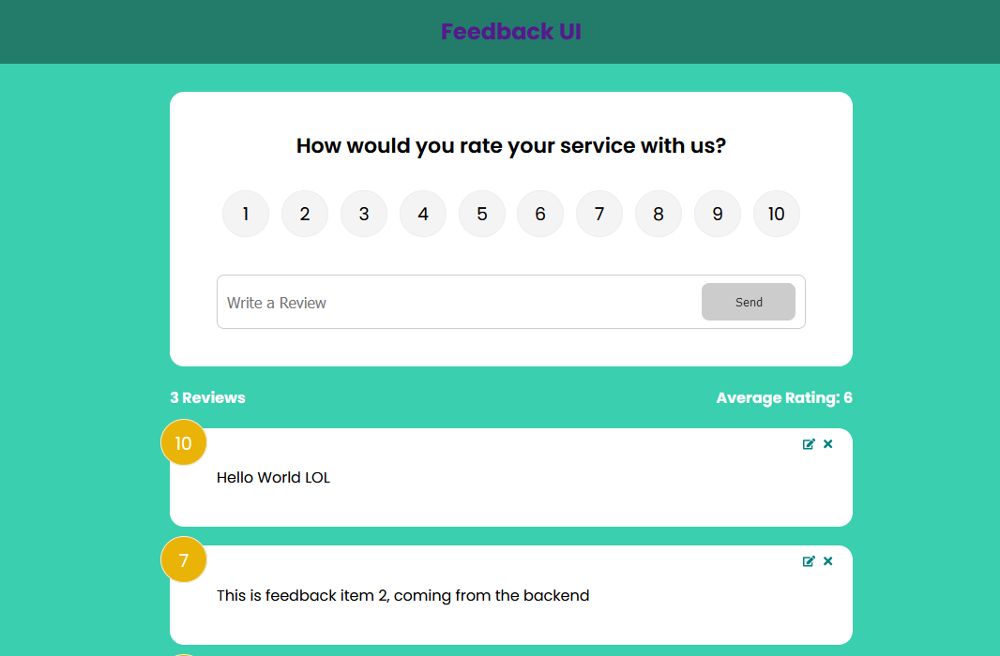

<h1>Feedback App</h1>

 <h3>Competencies</h3>
  

<h3>About </h3>

This app uses react.js to create a front-end feedback interface. This is my first foray into React and has been a fantastic learning experience. This course covers the fundamentals and basics of working with React, it also touches upon using json server as a mock-backend, alongside a brief foray into postman. Thise course covers things such as: 

<ul>
<li>Setting up the react environment</li>
<li>JSX syntax and how it works under the hood</li>
<li>Props</li>
<li>Components</li>
<li>State management</li>
<li>Use of higher order array methods</li>
<li>installation of packages into react</li>
</ul>

<h3>What I Didn't Know</h3>

This first foray into React was quite surprising, Although i felt comfortable with higher order array methods, alongside the use of ES6 modules, it still took sometime and alot of pausing to be able to understand exactly what was happeneing. I was quite surprised at the level of abstraction that React takes away from vanilla JS especially given the use of displaying elements and updating the state. I found the use of props slightly confusing at first but this became more familiar with time. I did refer back to the docs, alongside other content creators to become more familiar with certain React aspects. 

 I found the use of hooks quite easy to understand, alongside the use of async/await, due to their use in another project of mine. I was quite surprised how much I learnt regarding the use of vanilla JS, not just React.js. I do believe that if you jump into React without having a foundational knowledge in JS (as I have seen advertised), then you would struggle immensely.

 A couple of issues i faced in particular was understanding how props were passed down, and the use of "Prop Drilling" I get why this was used, but it definitely took some getting used to (a redundant practice now it seems). Also understanding why you were prop drilling, and how you would understand where to pass certain props. I understand now that the use context hook, coupled with a mock backend allows this to be cleaned up quite considerably, but it still took some getting used to. I managed to figure it out on my own, but i did consult the docs to be sure I had come to the correct conclusion. 

I did take some time to understand the additional objects used in the fetch requests, especially when a misspelt "Header:", took me two hours and alot of discord chats to debug (turns out it's "header:", without the capital H!). These were the two debugging issues that stood out to myself.

<h3> Pics </h3>

